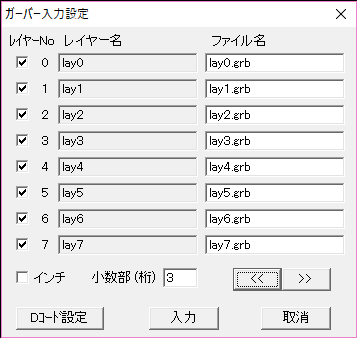
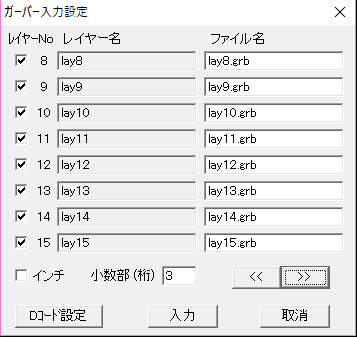

# OutputImageInPCBEFormat

## 概要
画像をガーバーデータ(拡張ガーバーフォーマットRS-274X相当)に出力し，
PCBEでインポートすると画像表示が出来る．やったね．すごいね．

## なにに役立つの
PCBEでレイヤー毎に色分け出来ることを用いて近似色レイヤーで該当部を描いてるだけなので
レイヤー毎に意味はないし少なくとも基板関係では役に立たない．

## 環境
- processing 3.2.4
- PCBE 0.63.4

では動作確認済み

## 使い方
- `OutputImageInPCBEFormat`フォルダ下にガーバーデータに出力したい `target.png`を配置する．

- `OutputImageInPCBEFormat.pde` を起動し実行する．
このときカラーで出力したい場合は `canOutputColor`の値を`true`に，黒背景&輪郭を緑で描きたい場合は`false`にする．

実行すると `lay0.grb` ～ `lay15.grb`が実行フォルダ下に生成される．

- `pcbe.exe`が存在するフォルダ下(デフォルトなら `C:\pcbe`)に存在する`pcbe.ini`をこのリポジトリに存在する`pcbe.ini`の内容で上書きする．

- `lay0.grb` ～ `lay15.grb`を`pcbe.exe`が存在するフォルダ下に配置する．

- `pcbe.exe`を起動する．

- [ファイル] → [ガーバー入力]を選択し，下記画像のように設定する．





- [入力]を押すとPCBE上に出力される．

以下にオリジナル画像と`canOutputColor`が`true`，`false`の時の出力例を示す．

また，今回オリジナル画像として使っているのは[AnzuChang!ジェネレータ](http://h071019.sakura.ne.jp/anzuchang.html)で配布されている画像である．

オリジナル画像


falseの結果


trueの結果


もちろんPCBEはプリント基板エディタでしかないので出力画像はキャプなりなんなりして撮る必要がある．

また，`canOutputColor`が`false`の場合の輪郭認識はRGBの各値が40以下であるならという条件で作っておりかなりガバガバなので良い結果が出ることがあまりないし昔作ったのを掘り起こして供養しただけのリポジトリなので特に改善しようとも思わない．

おわり．

## オプション
PCBE上の描画サイズを変更したい場合は`pcbe.ini`の下記部分X，Yの値を変更するとよい．デフォルトではどちらも500である．

```
[BoardSize]
X:500
Y:500
```


